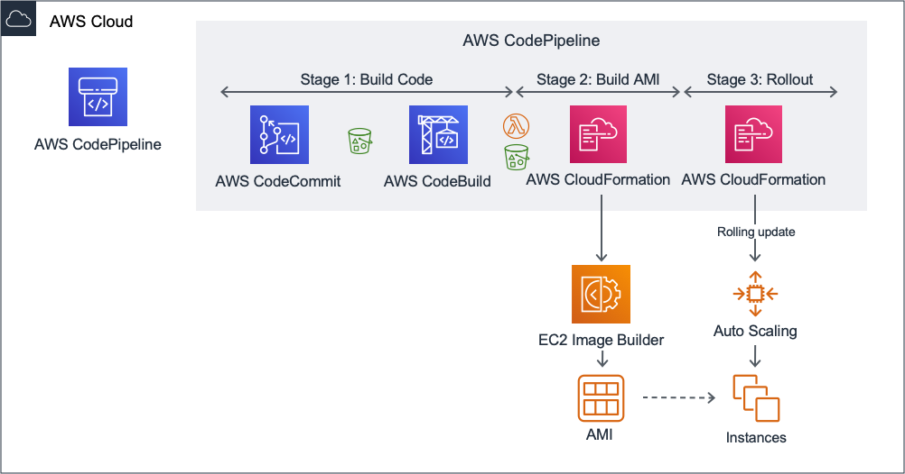
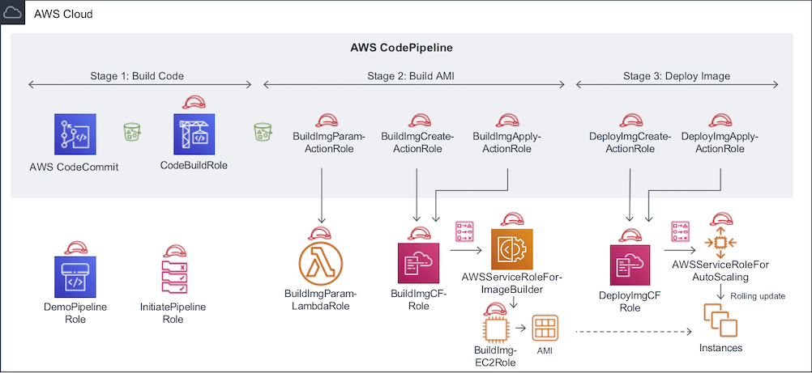

## AWS Sample: Immutable Server Pipeline

This code sample supports the forthcoming blog post "Create immutable servers using EC2 Image Builder and AWS CodePipeline". The blog post contains an AWS CloudFormation quick-create link to launch the pipeline. This repository contains the source code and detailed instructions so you can customize the example pipeline.

## Prerequisites

Before you can install this demo pipeline, you need the following:

1. An AWS account - this demo assumes you are well-familiar with basics and core concepts of AWS, have run CloudFormation before and are comfortable with EC2, S3, VPCs and IAM.

2. The AWS command line tools with sufficient IAM permissions to create resources for IAM, EC2 Image Builder, EC2 and S3. Consider using AWS Cloud9 for convenience.


3. A name for your stack:

  ```
  export STACK_NAME=Demo
  ```

3. An S3 bucket to host a ZIP file to pre-fill the CodeCommit repository with required content

  ```
  export BUCKET_NAME=my-bucket-name
  ```

4. VPC Subnets that can be used to spin up EC2 instances. For example, to select the subnets from the default VPC:

  ```
  export SUBNETS=$( \
    echo $( \
      aws ec2 describe-subnets \
        --output text \
        --query 'Subnets[?DefaultForAz==`true`].SubnetId' \
    ) | sed "s/ /\\\,/g")
  ```

Alternatively, the aws cli option `--filter` adds options to select subnets other parameters such as specific tags.

## Customizing the pipeline

To customize the pipeline:

1. Open a terminal window and download the code with git

  ```
  git clone https://github.com/aws-samples/immutable-server-pipeline.git
  ```

2. Open your favorite editor and modify the AWS CloudFormation templates to meet your requirements.

  ```
  cd immutable-server-pipeline
  vi cf-pipeline.yaml
  ```

Replace `vi` with the editor of your choice.

3. Package the code as a ZIP file:

  ```
  . create-zip-for-s3.sh
  ```

4. Upload the resulting ZIP file to S3:

  ```
  aws s3 cp codecommit-repo.zip s3://$BUCKET_NAME/codecommit-repo.zip
  ```

5. Apply the CloudFormation template:

  ```
  export STACK_ID=$(
    aws cloudformation create-stack \
      --stack-name $STACK_NAME \
      --template-body file://cf-pipeline.yaml \
      --parameters \
      ParameterKey=InitialCodeBucketName,ParameterValue=$BUCKET_NAME \
      ParameterKey=Subnets,ParameterValue=$SUBNETS \
      --capabilities CAPABILITY_IAM \
      --output text \
      --query StackId)
  aws cloudformation wait stack-create-complete --stack-name $STACK_ID
  ```

6. Open the AWS Codepipeline console and verify that the pipeline is running. Expect the Build Image step to take ~25-30 minutes.


## Customizing the image

To make changes to the content of the AMI:

1. Open the AWS Console for AWS CodeCommit, choose **Repositories** and select the repository corresponding to your stack name.

2. In the repository, find the file you would like to edit and choose **Edit**

3. After you are done modifying the file:

  - Fill in **Author name** and **Email address**
  - Describe the change in a **Commit message**
  - Choose **Commit changes**

4. Go back to the AWS Console for AWS CodePipeline and verify that a new pipeline run was initiated. Expect additional time for the 2nd run of the pipeline because of the rolling update.


## Avoiding cost by stopping the instance:

To avoid cost of running EC2 instances unnecessarily, reduce the desired capacity of the AutoScaling group.

1. Find the name of the AutoScaling group generated by AWS CloudFormation:

```
export ASG_NAME=$(aws cloudformation describe-stack-resources \
  --stack-name $STACK_NAME-DeployImg \
  --query 'StackResources[?ResourceType==`AWS::AutoScaling::AutoScalingGroup`]'.PhysicalResourceId \
  --output text)
```

2. Change the desired capacity for the AutoScaling group:

```
aws autoscaling update-auto-scaling-group --auto-scaling-group-name $ASG_NAME --desired-capacity 0
```

## Cleaning up:

To remove all the resources created by the sample code:

1. Delete the Cloudformation stack that created an AutoScaling group and launch template:

  ```
  aws cloudformation delete-stack --stack-name $STACK_NAME-DeployImg
  aws cloudformation wait stack-delete-complete --stack-name $STACK_NAME-DeployImg
  ```

2. Remove the AMIs and snapshots:

  - a. Verify that the specified query returns the desired images before deleting them (any images unintentionally named after your stack-name would be deleted):

    ```
    aws ec2 describe-images --owner self --query 'Images[?Name!=`null`]|[?starts_with(Name, `'"$STACK_NAME"'-Image`) == `true`].[ImageId,Name]' --output text
    ```

  - b. Remove the AMIs and snapshots:

    ```
    export AMIS=$(aws ec2 describe-images --owner self --query 'Images[?Name!=`null`]|[?starts_with(Name, `'"$STACK_NAME"'-Image`) == `true`].[ImageId]' --output text)
    export SNAPSHOTS=$(aws ec2 describe-images --owner self --query 'Images[?Name!=`null`]|[?starts_with(Name, `'"$STACK_NAME"'-Image`) == `true`].[BlockDeviceMappings[0].Ebs.SnapshotId]' --output text)
    ARR=($(echo "$AMIS" | tr ' ' '\n')); for i in ${ARR[@]}; do aws ec2 deregister-image --image-id $i; done
    ARR=($(echo "$SNAPSHOTS" | tr ' ' '\n')); for i in ${ARR[@]}; do aws ec2 delete-snapshot --snapshot-id $i; done
    ```

3. Delete the CloudFormation stack that created the EC2 Image Builder resources to build the AMI:

  ```
  aws cloudformation delete-stack --stack-name $STACK_NAME-BuildImg
  aws cloudformation wait stack-delete-complete --stack-name $STACK_NAME-BuildImg
  ```

4. Remove the S3 bucket with artifacts from the pipeline:

  ```
  export ARTIFACT_BUCKET=$(aws cloudformation describe-stack-resources \
    --stack-name $STACK_NAME \
    --query 'StackResources[?ResourceType==`AWS::S3::Bucket`].PhysicalResourceId' \
    --output text)
  aws s3 rm s3://$ARTIFACT_BUCKET/ --recursive 
  aws s3api delete-bucket --bucket $ARTIFACT_BUCKET 
  ```

5. Delete the original CloudFormation stack:

  ```
  aws cloudformation delete-stack --stack-name $STACK_NAME
  aws cloudformation wait stack-delete-complete --stack-name $STACK_NAME
  ```

6. Remove the version number for the images:

  ```
  aws ssm delete-parameter --name /$STACK_NAME/ImageVersion
  ```

## Relevant files in this repository

This repository contains multiple files and folders. For the purpose of understanding how this pipeline works, these files are relevant in particular:

 - cf-pipeline.yaml – The CloudFormation template defining the overall AWS CodePipeline
 - codecommit-repo/ – Pre-packaged content for the AWS CodeCommit repository:
    - src/  –  Source code for Stage 1 of the pipeline (Hello World in Java with Spring Boot)
    - cf-build-image.yaml – AWS CloudFormation template for Stage 2 of the pipeline
    - cf-deploy-image.yaml – The AWS CloudFormation template for Stage 3 of the pipeline

## Detailed overview of resources created by AWS CloudFormation

The forthcoming blog post gives an explanation of the high level architecture for this pipeline that builds AMIs. For your convenience, here is the illustration:



If we take the high-level architecture and dive one level deeper into what is happening, we notice there is a relatively large number of IAM Roles (each with their own Policies) required to make the pipeline work. To understand the purpose of each role, here is an alternative version of the architecture that focuses on all the roles being created:



Below is a description for each role in the diagram. Note that you will find the same description in the comments in the CloudFormation template.

| Role Name | Description |
| --- | --- |
| DemoPipelineRole | Role assumed by AWS Codepipeline overall, to access S3, CodeCommit, CodeBuild and for AWS Codepipeline actions to assume roles to invoke AWS Lambda and AWS Cloudformation templates | 
| InitiatePipelineRole | Role assumed by AWS CloudWatch Event Rules to start AWS Codepipeline upon a commit to the master branch in AWS CodeCommit |
| CodeBuildRole | Role assumed by AWS CodeBuild to perform the compilation | 
| BuildImgParamLambdaRole | Role assumed by AWS Lambda function itself to prepare parameters for the next stage | 
| BuildImgParamActionRole | Role assumed by the specific action in CodePipeline that calls the AWS Lambda that prepares parameters for the next stage | 
| BuildImgCFRole | Role assumed by AWS CloudFormation to call EC2 Image Builder and build the AMI | 
| BuildImgCreateActionRole | Role assumed by the specific action in CodePipeline that calls CloudFormation to create a change set for calling EC2 Image Builder | 
| BuildImgApplyActionRole | Role assumed by the specific action in CodePipeline that calls CloudFormation to apply a change set for calling EC2 Image Builder | 
| DeployImgCFRole | Role assumed by AWS CloudFormation to create a LaunchTemplate version and perform a rolling deployment on the AutoScalingGroup | 
| DeployImgCreateActionRole | Role assumed by the specific action in CodePipeline that calls CloudFormation to create a change set for rolling out the AMI | 
| DeployImgApplyActionRole | Role assumed by the specific action in CodePipeline that calls CloudFormation to apply a change set for rolling out the AMI | 
| BuildImgEC2Role | Role assumed by temporary EC2 instance used by EC2 Image Builder while building the new AMI | 
| AWSServiceRoleForImageBuilder | Service Linked Role for EC2 Image Builder. If EC2 Image Builder has not yet been used before in the account, EC2 Image Builder will need permissions to create this role and hence iam:CreateServiceLinkedRole permissions are provided for EC2 Image Builder. |
| AWSServiceRoleForAutoScaling | Service Linked Role for AutoScaling. If Auto Scaling has not yet been used before in the account, AutoScaling will need permissions to create this role and hence iam:CreateServiceLinkedRole permissions are provided for Autoscaling. |


## Known limitations

 - The Spring Boot version used in the Java code sample is not necessarily up-to-date with the latest versions or security patches. Update the demo Spring Boot application to the latest version of Spring Boot before opening up access to the outside world.  
 - The final step of the pipeline creates an AutoScaling group. The demo does _not_ create an Application Load Balancer. Create an Application Load Balancer to review the result of the demo in a browser. It is recommended to limit access to only your own IP initially.
 - The installation script for the AMI is built-in in the AWS CloudFormation template and stored in the same AWS CodeCommit repository as the Java source code. If you want to maintain this script separately, you can extract it into a separate file. You can even create a sparate AWS CodeCommit repository for all infrastructure related code and add it as an additional input source to the AWS Codepipeline
 - The pipeline creates an AMI in a single AWS Region. If you want to distribute AMIs across multiple regions, you can adopt additional constructs from EC2 Image Builder like distribution configuration.
 - The version number is generated from an AWS Systems Manager Parameter Store parameter. You can replace this mechanism with an alternative of your choice. For example, some teams have a version number in the source code itself. Please be aware that this pipeline requires the versions to be unique for each iteration.
 - The pipeline does a single deployment to a single environment. In order to extend the pipeline to subsequent environments (that is quality assurance, production) it is recommended to create new, separate LaunchTemplates with their own versions for each environment. This way you keep environment specific metadata separated while reusing the exact same AMI across environments.

## Security

See [CONTRIBUTING](CONTRIBUTING.md#security-issue-notifications) for more information.

## License

This library is licensed under the MIT-0 License. See the LICENSE file.

